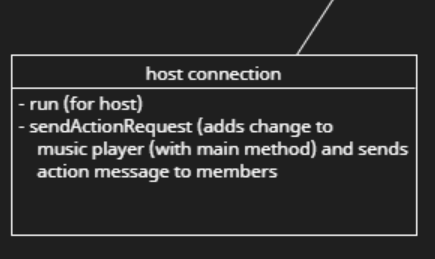
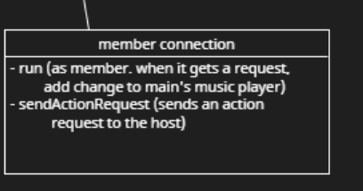
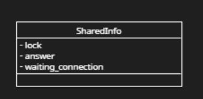
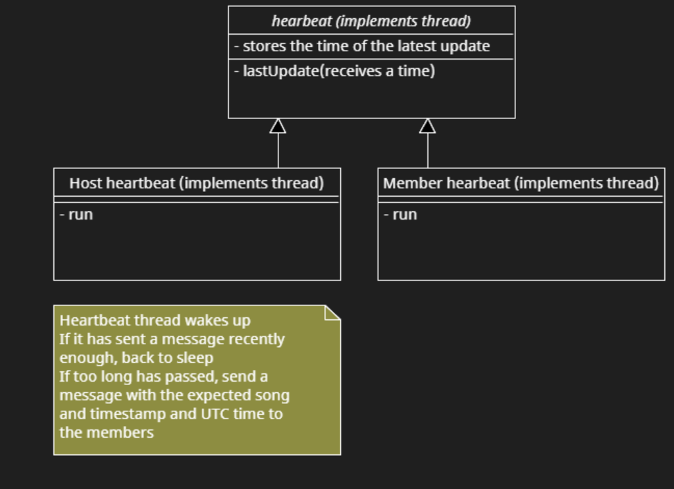
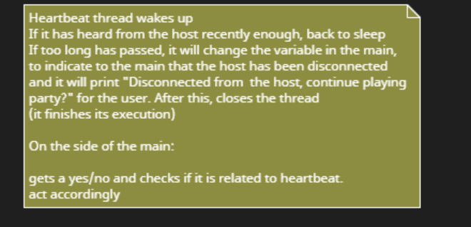

# To do:
- Ask teacher:
   + level of complication:
        + Can we assume all nodes have access to the same music files and just control that they play those music files at the same time?
            We can assume all nodes have all the files. We don't need to do everythimng, but acknowledge the things
        + If not, then we will have a central node
   + People behind computers making choices: the nodes will not need to decide all that much.
        + Would that be okay?
            People can make the decisions, don't overthink, have simple scenario
   + What exactly do we have to submit for the 15th the topic thing?
   + Node discovery??? If I know a node's ip address, how do I connect to it taking into account NAT?
      + You do not overcome NAT, use virtual machines or use hotspot or the computers in uni
      + NAT traversal if we want to look it up

# Things to think about
- How does a node in the p2p network notice that the connection to other nodes is lost?
- How do the heartbeat messages from the host work, if 30 secs have passed and I do not have a message, is it bc the host has failed or because there is a small delay?
# Notes:

**Achitecture:**

Decentralised peer to peer

**Middleware:**

Sockets
Not websockets because they are for web
We will not use message-based systems because we want real-time communication

**General idea:**

+ Each node has their own music files which need not be on the other nodes
+ If a node wants to play syncronised music, it will share a request with the other nodes
    + For each node that joins, the main node will share the file, after checking with the node that it does not have it
        + Then, the main node will coordinate the music playing

    + There are three phases:
        + First, the node sends the request and all the nodes reply
           + If two nodes send a request, there is an election
        + Second, the node tries to share the file with the ones that don't have it
        + Third, the node coordinates the music player
            + When the leader node is told to take an action, it will send a message to the other nodes: this action will be taken in UTC whatever time, that time being a few seconds ahead of the node's current time, to give the nodes time to receive the message and take the action

    + **Scalability**
        + We use something like gnutella but for request parties (REDESII P2P slide 15)
        + So the nodes are connected to other nodes but not all nodes
        + The idea is to have several small music parties as opposed to one big one
        + If a node wants to play, they will send a request to neighbouring nodes, these nodes will propagate the request
            + All the nodes that accept will share their ip address and port to generate a connection with the host

        + Once the host has received enough accepts, the playing party begins
            + The playing party begins when either 3 accepts are received or a timeout has passed

    + **General ideas for file transfer**
        
        - One party, one song
        - Each party has a limit of songs to send, for example, five songs per party. Before starting the party, the host node will send all of the songs it wants to play.
        - The party starts when 5 songs have been shared when they are shared, the host can move only between these five songs. While these songs are playing, the host is sharing the rest of the songs in the background
        - How about having playlists? Maybe the host node can chose a playlist and use some bittorrent deal for getting playlists????

    + During the party:
        - The host node can skip the current song and chose the songs to play, only within the playing-pool shared
        - Will other nodes be able to make music choices??

### Project description
+ 2-3 pages long 
+ describe the topic, architecture (nodes and their roles), if it is going to have fases
+ how nodes are going to communicate

### Tasks
Each person should decide how their code with communicate with other people's code, for example, define the method definitions and variables that they have.
When doing the code, if you make any assumptions of what other people have done, inform and write them down so that putting things together is as easy as possible.

# For next week (to be done before class on the 04th of December)

Hard tasks:
- Playing thread + update class
    - This person will take care of the circle in the class diagram. That is, they will take care of all of the music playing, the methods that indicate that a song change is to be added and making those changes happen.
    - They will also have to create the class Update
    - They will have to implement the method in the main class which makes the changes in the Music Player (this is the method connections will call in the sendActionRequest method).

- Main menu when there is playing party
    - This person will create the menu that will be displayed while the user is in the playing party. This menu is in the terminal, there is no need for interface and will be in the main class. The user will be given options for song modifications: play, pause, skip, go backwards. The person who does this task will get the command from the user, and call the pertinent methods in connection. This person does not have to implement the methods in connection that will take care of these commands.
    - This person will have to take into account, when receiving a command from the user that it might be a response to a heartbeat promt and will have to deal with it accordingly (see notes in the class diagram around heartbeat)
    - This menu will be the same for host and members.

- Connection for the playing party host:
    - 
    - This person will have to take care of the connection thread for the host: listen to the requests from the clients and update the music player and inform the rest of the nodes.
    - This person has to do the method sendActionRequest which calculates the time in which the action will be executed, sends the messages and calls the method in the main to make the changes in the MusicPlayer. This person doesn't have to implement the method in the main.
    - The same method can be can called when the user makes a request by terminal and when it receives a request from the members.

- Main menu when there is no playing party
    - Read steps bellow (follow all of the steps until "connection")

Easy tasks:
- Connection for the playing party member:
    - 
    - This person will have to take care of the connection thread for the members: listen to the host requests and make the changes to the music player. 
    
- Connection for a non-playing party member
    - 
    - Implement shared info class
    - Follow the steps below from "connection"

- Menu playing party chose songs and order
    - This person creates a method which asks the user which songs it wants to play and returns the list of songs (name of the song files).
    - It has to check if the songs given exist. 
    - This person also has to implement the part of the main which calls this method (and add the songs to the music player).

- Heartbeat threads
    - 
    - 

## Algorithms

Figure out playing party thing between connection and main:

Main:

- Has a variable last_request that is null if there are no requests
- Has a variable answer that is null that is null unless the user has replied
- Has a lock for the threads to control the access to these variables
- Has a bool variable called host to indicate if the user has requested a playing party

Steps:
0- Waiting for user input
1- Set host to true
2- I check if I last_request is null or not. i. e. if there is a thread waiting for answer
    3.a - There is a thread waiting for answer
        3.a.a. - The input was Yes/ no
            3.a.a.1 - Changes variable answer to have the user's answer
                If the answer was no, go back to 0
                If the answer was yes, move on to playing party joining etc
        3.a.b. - The input was "party"
                    This means that the user said that they wanted to do a playing party and then got a request
            3.a.b.1 - Wait for yes/no input of request
            3.a.b.2 - Changes variable answer to have the user's answer
                If the answer was no, go to creating a playing party
                If the answer was yes, move on to playing party joining etc and then return to 0
    3.b There is no thread waiting
        3.b.a - If command was not party, tell user: what was that? Back to step 0
        3.b.b - If command was party, move on to creating a playing party.

main: release playing party response answering lock

Connection:
0- Waiting for messages

CASE 1:
1- I get a request
2- If host is true, ignore request, back to 0
If host is false:
3- Acquire lock for asking user (request)
4- Check if host is true:
    If host is true, back to 0
    If host is false

7- Ask user
5- Set myself as the last_request in main
8- wait for answer to not be null
9- When answer is not null, read what it is,

if answer is false, 
    10- Free lock
    11- go back to 0

if answer is true, continue to playing party member
    Remember to release lock at some point

Main has to put host back to false at some point
Was nonsense starts off as null in the loop every time
Set answer to null

CASE 2:

1- I get a playing party response
2- If host is false, ignore, back to 0
If host is true:
3- Acquire lock for asking user (response)
4- Set myself as the last_response in main
5- Set response_answer to be null
6- Ask user
7- wait for answer to not be null
8- When answer is not null, read what it is

If answer is false
    Exit thread, finish execution

If answer is true, continue to playing party whatever

## Within playing party

##### Host

- Threads:
 - 1 thread per connection
 - 1 thread for hearbeat
 - 1 thread for main (listening on user input)
 - 1 thread for music player
- There is a lock to control who will add the next action

Whoever gets the lock:
- Calculate when the change has to occur
- Tells the player when the change needs to occur and what the action is

## Things to think about

- When/how to make playing list (in main)
- Same person to do the main adds change to player and player adds change

####

- Playing party menu heartbeat problems part (Elena)
- Update list order

#### SCHEDULE

- What happens if the connection is closed? (thread starting)

### Comments

- We send the songs with the request, but in reality we would not do it like this

