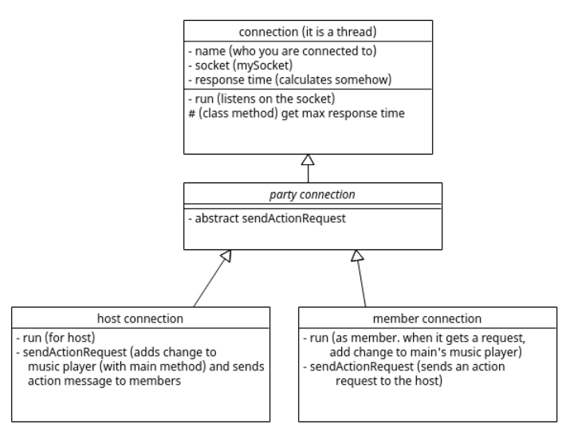
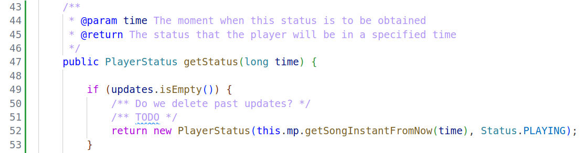

### EC: 
**New things**
- I am going to create a folder connection for  this part of the diagram. I am also going to take out connection.java from the P2P folder, because I don't think it makes sense for it to be there anymore I am also going to create the abstract class party connection inside a folder called party. My idea is to put in that folder all of the playing-party related files and classes
- I have also created the enum Action, but it is not complete.
    - It has a method match that, given a string, it will return the element in the enum it matches. Or null if it's none of them
- I have somewhat changed the connection part of the class diagram, for it to make a bit more sense
- The friends list and everything no longer exists
- I am going to add a method in connection receive(String type) this method is the same as receive, only that it will only return if the message type is the one given. It wil discard all other messages
- If, as the host, I get null in a socket, I will close it and assume that person is no longer in the playing party
- The main stores the time it took for the users to reply to the playing party request
    - To handle this I have added two methods:
        - getSeconds (private, it will return the seconds the time it took for the users to reply to the playing party request)
        - getNearestChange (public, taking into account the seconds it took to reply and the current time, it returns the time the next change can take place)
- For UTC time I am using the seconds since EPOCH 
- The fields in the action message are as follows:
    ret.put("action", status.toString());
    ret.put("action_timestamp", executionTime);
    ret.put("song_name", songName);
    ret.put("song_time", songTime);
    ret.put("total_updates", num_updates - 1);
- I have created a class that is PlayerStatus that has a song instant and a status
- I have created a method that sends the given JSONObject to all the connections that the main has it is called sendToAllConnections(JSONObject message) and it is in main
- The method in main that adds a change to the music player I have called addAction

**Questions**
- What do we do with exeptions?
- Why are the methods in main private static?
- It would make sense for the music player to have a method to figure out if a user is out of sync or not, or to determine if any changes need to be made (so that the music doesn't jump around with the heartbeats unnecessarily). What do you think?
- Reset update counter, is it correct to be sending the num_updates with a -1?
- Are we taking into account that there could be several updates lined up and you can ask for a time before one of the updates?
-  Is this correct? In MusicPlayerThread.java

### CCV (For the 4th of December)
- I have used miliseconds since Epoch for UTC time and the class Duration from javafx.util (don't get confuse with other existent Duration classes in Java) to represent a certain instant in a song. E.g. if we are playing a song at 2pm and the song its currently playing the instant 0:30, 3pm is represented in UTC time and 0:30 in Duration.  
- SongInstant represents a song (known by its name) and a certain instant of the song,
- Call method getPosition(long time) to know what the music player will be doing at a certain time (taking into account the updates that the player has received until the moment is called). 
- Class Status to represent if the player is currently paused or playing
- MessageType added to represent the different types of messages. Feel free to add new ones you may need. 

### CCV:
- I will use a class called MusicPlayer to implement the functionalities related with handling music playing.
- The class is initialized with a list of names of songs (the ones that will be played) and it allows to add new songs.
- I've assumed the songs are stored in some folder called resources/songs. 
- My part for this week is contained in the folder music_player. More information about its structure and how to execute it can be found in the README of that folder. 
